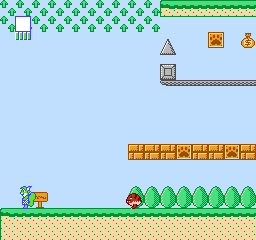
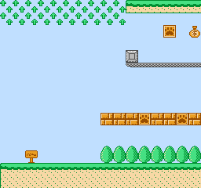
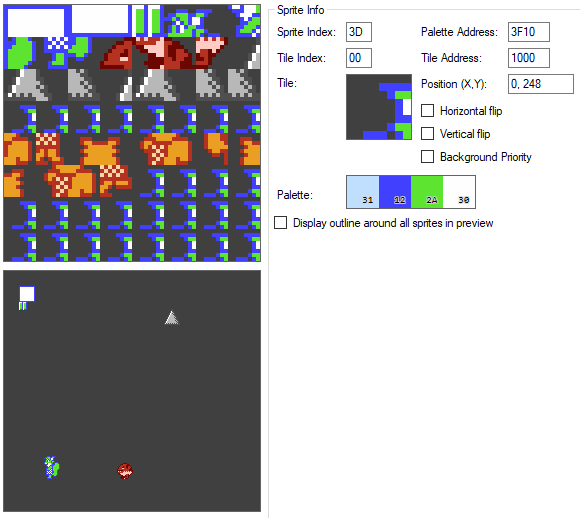
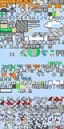
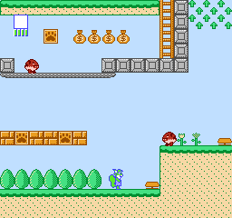
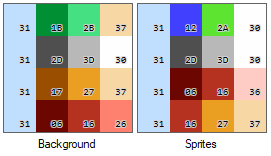

# Memorias ROM similares a las usadas por la NES

Juego complejo  

https://novasquirrel.itch.io/nova-the-squirrel

https://github.com/NovaSquirrel/NovaTheSquirrel

## Nova de Squirrel

### Memorias ROM VHDL

En el directorio [comb](vhd/comb) están las ROM sin reloj (combinacionales)

En el directorio [clk](vhd/clk) están las ROM con reloj

En el directorio [vrl](vrl) están las memorias en verilog, con reloj y sin reloj.

[nova_ntable.vhd](vhd/clk/nova_ntable.vhd): Mapa de mosaicos/teselas (Tabla de nombres) de 2KiB. Por lo tanto hay dos tablas de 1KiB. Al final de cada tabla están los 64 B de la tabla de atributos

[nova_ntable_attr.vhd](vhd/clk/nova_ntable_attr.vhd): Los 64 bytes de la tabla de atributos separados de la tabla de nombres

[nova_ptable.vhd](vhd/clk/nova_ptable.vhd): Los mosaicos (tiles), la tabla de patrones de sprites y de fondo. Con los dos planos de color. 8KiB en total

[nova_ptable_0.vhd](vhd/clk/nova_ptable_0.vhd): Los mosaicos (tiles), la tabla de patrones de sprites y de fondo. Con el plano de color 0. 4KiB en total

[nova_ptable_1.vhd](vhd/clk/nova_ptable_1.vhd): Los mosaicos (tiles), la tabla de patrones de sprites y de fondo. Con el plano de color 1. 4KiB en total

[nova_ptablespr.vhd](vhd/clk/nova_ptablespr.vhd): Los mosaicos (tiles), la tabla de patrones de sprites (sin fondo). Con los dos planos de color. 4KiB en total

[nova_ptablebg.vhd](vhd/clk/nova_ptablebg.vhd): Los mosaicos (tiles), la tabla de patrones de fondo (sin sprites). Con los dos planos de color. 4KiB en total

[nova_ptablespr_0.vhd](vhd/clk/nova_ptablespr_0.vhd): Los mosaicos (tiles), la tabla de patrones de sprites (sin fondo). Con el plano de color 0. 2KiB en total

[nova_ptablespr_1.vhd](vhd/clk/nova_ptablespr_1.vhd): Los mosaicos (tiles), la tabla de patrones de sprites (sin fondo). Con el plano de color 1. 2KiB en total

[nova_ptablebg_0.vhd](vhd/clk/nova_ptablebg_0.vhd): Los mosaicos (tiles), la tabla de patrones de fondo (sin sprites). Con el plano de color 0. 2KiB en total

[nova_ptablebg_1.vhd](vhd/clk/nova_ptablebg_1.vhd): Los mosaicos (tiles), la tabla de patrones de fondo (sin sprites). Con el plano de color 1. 2KiB en total

[nova_ntable_start_nt0.vhd](vhd/clk/nova_ntable_start_nt0.vhd): El mapa de mosaicos (name table), para la pantalla de inicio. 1KiB

[nova_oam_00.vhd](vhd/clk/nova_oam_00.vhd): El estado de la memoria de sprites (OAM) en un momento dado

[nespalette_colors.vhd](../nespalette_colors.vhd): Paleta con 64 colores RGB444 de la NES

### Imágenes para depurar

Esta es la pantalla que se quiere mostrar:

El fondo, pero sin sprites:

Solo tiene varios sprite 8x8:

Vista de la Tabla de Patrones (memoria ROM de teselas)

Otra pantalla haciendo scroll:

Paleta:

---

