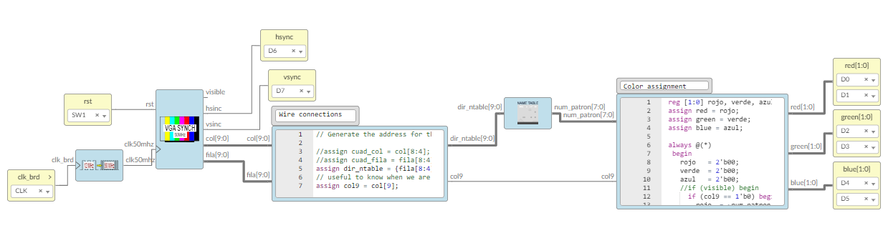

# Sample projects

## [Ice Blocks](ice_blocks)
 
Icestudio blocks

---

## [Name Table](nametable/smario)

First project just to understand how the Name Table works.

VHDL, verilog and Icestudio versions
 
Video para más información: https://youtu.be/Twvdh8xt7a4

Y pdf: https://doi.org/10.5281/zenodo.5303187 

### [Icestudio project](nametable/smario/icestudio)

