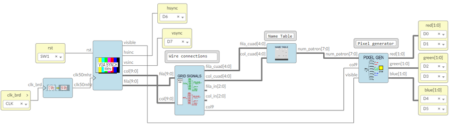
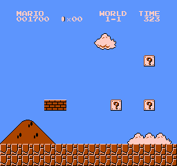
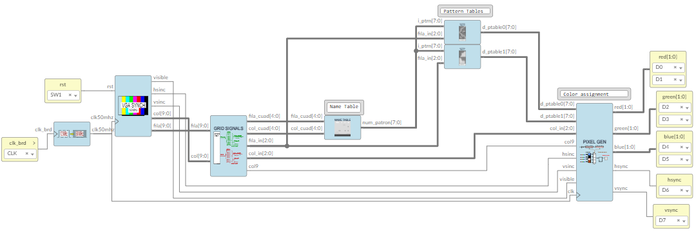

# Sample projects

## [Ice Blocks](ice_blocks)
 
Icestudio blocks

---

## [Example 1: Name Table](p1_ntable/smario)

First project just to understand how the Name Table works.

VHDL, verilog and Icestudio versions
 
Video para más información: https://youtu.be/Twvdh8xt7a4

Y pdf: https://doi.org/10.5281/zenodo.5303187 

### [Icestudio project](p1_nable/smario/icestudio)

## [Example 2: Name + Pattern Tables](p2_np_tables/smario)

Second project includes Name Table and the Pattern Table divided in two memories, not including the sprites
Only one palette because there is no Attribute Table: only 4 colors in total

VHDL, verilog and Icestudio versions

### [Icestudio project](p2_np_tables/smario/icestudio)

