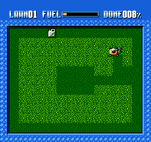
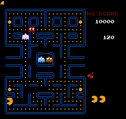

# Memorias ROM similares a las usadas por la NES

Gráficos basados en mapas de teselas

## [Sprilo](sprilo/readme.md)

Juego sencillo con un sprite simple de 8x8, bueno para empezar y probar que va bien

https://cmrn.itch.io/sprilo

https://github.com/cbrwn/gameoff

---

## [Super Mario](smario/readme.md)

---

## [Lawn Mower](lawnmower/readme.md)

Juego sencillo:

https://shiru.untergrund.net/software.shtml

https://github.com/sehugg/lawn-mower-nes

---

## [Pac-Man](pacman/readme.md)

---

## [Nova the Squirrel](nova/readme.md)

