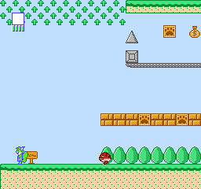

# Memorias ROM similares a las usadas por la NES

Gráficos basados en mapas de teselas

## [Sprilo](sprilo)

Juego sencillo con un sprite simple de 8x8, bueno para empezar y probar que va bien

https://cmrn.itch.io/sprilo

https://github.com/cbrwn/gameoff

---

## [Super Mario](smario)

Pantalla de las presentaciones:

Pantalla de inicio:

---

## [Lawn Mower](lawnmower)

Juego sencillo:

https://shiru.untergrund.net/software.shtml

https://github.com/sehugg/lawn-mower-nes

---

## [Pac-Man](pacman)

---

## [Nova the Squirrel](nova)

