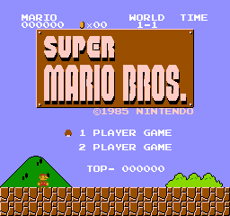

# Memorias ROM similares a las usadas por la NES

## SuperMario Traspas

Pantalla SuperMario:

Fondo SuperMario:

### Memorias ROM VHDL

[smario_traspas_nt_nt0.vhd](traspas/vhd/comb/smario_traspas_nt_nt0.vhd): Mapa de teselas (Tabla de nombres) de 1KiB. Por lo tanto hay una sola tablas de 1KiB. Al final de la tabla están los 64 B de la tabla de atributos

## SuperMario 00

Pantalla Inicio SuperMario:

### Memorias ROM VHDL

[smario_ntable01.vhd](00/vhd/comb/smario_ntable_01.vhd): Mapa de teselas (Tabla de nombres) de 2KiB. Por lo tanto hay dos tablas de 1KiB. Al final de cada tabla están los 64 B de la tabla de atributos

[smario_ntable_01_nt0.vhd](00/vhd/comb/smario_ntable_01_nt0.vhd): Mapa de teselas (Tabla de nombres) de 1KiB. Por lo tanto hay una sola tablas de 1KiB. Al final de la tabla están los 64 B de la tabla de atributos

[smario_ntable01_attr.vhd](00/vhd/comb/smario_ntable01_attr.vhd): Los 64 bytes de la tabla de atributos separados de la tabla de nombres

[smario_ptable.vhd](00/smario_ptable.vhd): Las teselas (tiles), la tabla de patrones de sprites y de fondo. Con los dos planos de color. 8KiB en total

[smario_ptable_0.vhd](00/smario_ptable_0.vhd): Las teselas (tiles), la tabla de patrones de sprites y de fondo. Con el plano de color 0. 4KiB en total

[smario_ptable_1.vhd](00/smario_ptable_1.vhd): Las teselas (tiles), la tabla de patrones de sprites y de fondo. Con el plano de color 1. 4KiB en total

[smario_oam_02.vhd](00/smario_oam_02.vhd): El estado de la memoria de sprites (OAM) en un momento dado

[nespalette_colors.vhd](../nespalette_colors.vhd): Paleta con 64 colores RGB444 de la NES
