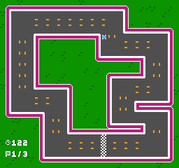
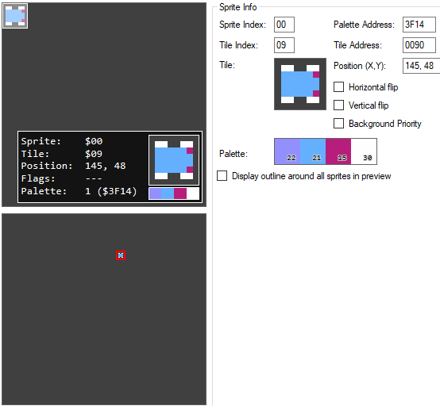
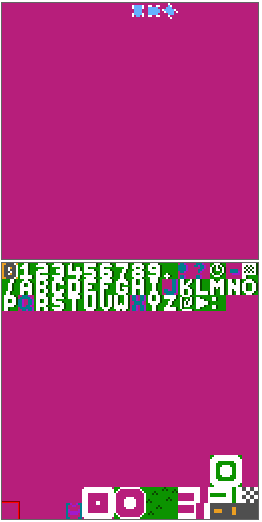

# Memorias ROM similares a las usadas por la NES

Juego sencillo con un sprite simple de 8x8, bueno para empezar y probar que va bien

https://cmrn.itch.io/sprilo

https://github.com/cbrwn/gameoff

* [Sprilo 00](#Sprilo00)

---

## Sprilo 00

### Memorias ROM VHDL

En el directorio [comb](00/vhd/comb) están las ROM sin reloj (combinacionales)

En el directorio [clk](00/vhd/clk) están las ROM con reloj

En el directorio [vrl](00/vrl) están las memorias en verilog, con reloj y sin reloj.

[sprilo_ntable00.vhd](00/vhd/clk/sprilo_ntable_00.vhd): Mapa de mosaicos/teselas (Tabla de nombres) de 2KiB. Por lo tanto hay dos tablas de 1KiB. Al final de cada tabla están los 64 B de la tabla de atributos

[sprilo_ntable00_nt0.vhd](00/vhd/clk/sprilo_ntable_00_nt0.vhd): Mapa de mosaicos/teselas (Tabla de nombres) de 1KiB. Por lo tanto hay una sola tabla, ya que en este juego no se hace _scroll_ y por lo tanto la otra no se utiliza. Al final de la tabla están los 64 B de la tabla de atributos

[sprilo_ntable00_attr.vhd](00/vhd/clk/sprilo_ntable_00_attr.vhd): Los 64 bytes de la tabla de atributos separados de la tabla de nombres

[sprilo_ptable.vhd](00/vhd/clk/sprilo_ptable.vhd): Los mosaicos (tiles), la tabla de patrones de sprites y de fondo. Con los dos planos de color. 8KiB en total

[sprilo_ptable_0.vhd](00/vhd/clk/sprilo_ptable_0.vhd): Los mosaicos (tiles), la tabla de patrones de sprites y de fondo. Con el plano de color 0. 4KiB en total

[sprilo_ptable_1.vhd](00/vhd/clk/sprilo_ptable_1.vhd): Los mosaicos (tiles), la tabla de patrones de sprites y de fondo. Con el plano de color 1. 4KiB en total

[sprilo_ptablespr.vhd](00/vhd/clk/sprilo_ptablespr.vhd): Los mosaicos (tiles), la tabla de patrones de sprites (sin fondo). Con los dos planos de color. 4KiB en total

[sprilo_ptablebg.vhd](00/vhd/clk/sprilo_ptablebg.vhd): Los mosaicos (tiles), la tabla de patrones de fondo (sin sprites). Con los dos planos de color. 4KiB en total

[sprilo_ptablespr_0.vhd](00/vhd/clk/sprilo_ptablespr_0.vhd): Los mosaicos (tiles), la tabla de patrones de sprites (sin fondo). Con el plano de color 0. 2KiB en total

[sprilo_ptablespr_1.vhd](00/vhd/clk/sprilo_ptablespr_1.vhd): Los mosaicos (tiles), la tabla de patrones de sprites (sin fondo). Con el plano de color 1. 2KiB en total

[sprilo_ptablebg_0.vhd](00/vhd/clk/sprilo_ptablebg_0.vhd): Los mosaicos (tiles), la tabla de patrones de fondo (sin sprites). Con el plano de color 0. 2KiB en total

[sprilo_ptablebg_1.vhd](00/vhd/clk/sprilo_ptablebg_1.vhd): Los mosaicos (tiles), la tabla de patrones de fondo (sin sprites). Con el plano de color 1. 2KiB en total

[sprilo_oam_00.vhd](00/vhd/clk/sprilo_oam_00.vhd): El estado de la memoria de sprites (OAM) en un momento dado

[nespalette_colors.vhd](../nespalette_colors.vhd): Paleta con 64 colores RGB444 de la NES

### Imágenes para depurar

Esta es la pantalla que se quiere mostrar:

Solo tiene un sprite 8x8:

Vista de la Tabla de Patrones (memoria ROM de teselas)

---

