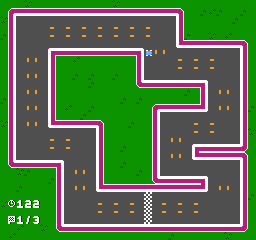
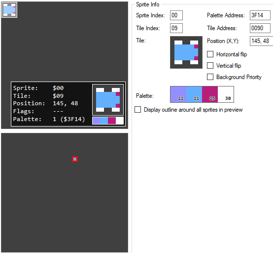
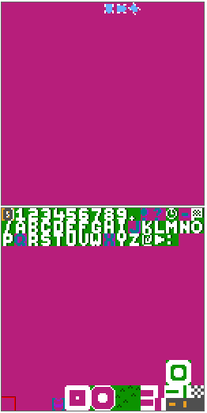

# Memorias ROM similares a las usadas por la NES

## Sprilo

Juego sencillo con un sprite simple de 8x8, bueno para empezar y probar que va bien

https://cmrn.itch.io/sprilo

https://github.com/cbrwn/gameoff

### Memorias ROM VHDL

[sprilo_ntable00.vhd](00/vhd/sprilo_ntable_00.vhd): Mapa de mosaicos/teselas (Tabla de nombres) de 2KiB. Por lo tanto hay dos tablas de 1KiB. Al final de cada tabla están los 64 B de la tabla de atributos

[sprilo_ntable00_attr.vhd](00/vhd/sprilo_ntable_00_attr.vhd): Los 64 bytes de la tabla de atributos separados de la tabla de nombres

[sprilo_ptable.vhd](00/vhd/sprilo_ptable.vhd): Los mosaicos (tiles), la tabla de patrones de sprites y de fondo. Con los dos planos de color. 8KiB en total

[sprilo_ptable_0.vhd](00/vhd/sprilo_ptable_0.vhd): Los mosaicos (tiles), la tabla de patrones de sprites y de fondo. Con el plano de color 0. 4KiB en total

[sprilo_ptable_1.vhd](00/vhd/sprilo_ptable_1.vhd): Los mosaicos (tiles), la tabla de patrones de sprites y de fondo. Con el plano de color 1. 4KiB en total

[sprilo_oam_00.vhd](00/vhd/sprilo_oam_00.vhd): El estado de la memoria de sprites (OAM) en un momento dado

[nespalette_colors.vhd](../nespalette_colors.vhd): Paleta con 64 colores RGB444 de la NES

### Imágenes para depurar

Esta es la pantalla que se quiere mostrar:

Solo tiene un sprite 8x8:

Vista de la Tabla de Patrones (memoria ROM de teselas)

---

## Super Mario

[smario_ntable01.vhd](smario_ntable01.vhd): Mapa de mosaicos (Tabla de nombres) de 2KiB. Por lo tanto hay dos tablas de 1KiB. Al final de cada tabla están los 64 B de la tabla de atributos

[smario_ntable01_attr.vhd](smario_ntable01_attr.vhd): Los 64 bytes de la tabla de atributos separados de la tabla de nombres

[smario_ptable.vhd](smario_ptable.vhd): Los mosaicos (tiles), la tabla de patrones de sprites y de fondo. Con los dos planos de color. 8KiB en total

[smario_ptable_0.vhd](smario_ptable_0.vhd): Los mosaicos (tiles), la tabla de patrones de sprites y de fondo. Con el plano de color 0. 4KiB en total

[smario_ptable_1.vhd](smario_ptable_1.vhd): Los mosaicos (tiles), la tabla de patrones de sprites y de fondo. Con el plano de color 1. 4KiB en total

[smario_oam_02.vhd](smario_oam_02.vhd): El estado de la memoria de sprites (OAM) en un momento dado

[nespalette_colors.vhd](nespalette_colors.vhd): Paleta con 64 colores RGB444 de la NES
