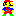

# Ejemplos VHDL

En el directorio [../nesrom](../nesrom) hay memorias para hacer gráficos basados en mosaicos (_tile based_)

En el directorio [projects/img_memo_vga_1/vhd](projects/img_memo_vga_1/vhd) hay un ejemplo de como pintar una memoria en la VGA
Tienes videos que lo explican aquí:

1. Tutorial 1: https://youtu.be/xqytkCZlQxQ Contadores decimales
2. Tutorial 2: https://youtu.be/BteyXG891YI Contadores decimales, mostrar en cuadrícula
3. Tutorial 3: https://youtu.be/2Urj9zEU5R8 Contadores decimales, mostrar en cualquier parte
4. Tutorial 4: https://youtu.be/FY7PnAW4cCI Contadores binarios
5. Tutorial 5: https://youtu.be/ns7eot0pwo0 Ampliar imagen: laberinto
6. Tutorial 6: https://youtu.be/7NUEXcu0BJk Imágenes en color
7. Tutorial 7: https://youtu.be/Oyckgeg_nnE Imágenes en color con una memori

## Monstruo (fantasma) del pac-man
* Imagen de 32x32.
* 3 memorias, una para cada color
* bits para cada color
* 

1. [rom4b_blue_monster32x32.vhd](rom4b_blue_monster32x32.vhd)
1. [rom4b_red_monster32x32.vhd](rom4b_red_monster32x32.vhd)
1. [rom4b_green_monster32x32.vhd](rom4b_green_monster32x32.vhd)

## Mario
* Imagen de 32x32.
* 3 memorias, una para cada color
* bits para cada color
* 

1. [rom4b_blue_mario32x32.vhd](rom4b_blue_mario32x32.vhd)
1. [rom4b_red_mario32x32.vhd](rom4b_red_mario32x32.vhd)
1. [rom4b_green_mario32x32.vhd](rom4b_green_mario32x32.vhd)

## Pac-Man
* Imagen de 32x32.
* 3 memorias, una para cada color
* bits para cada color
* 

1. [rom4b_blue_pacman32x32.vhd](rom4b_blue_pacman32x32.vhd)
1. [rom4b_red_pacman32x32.vhd](rom4b_red_pacman32x32.vhd)
1. [rom4b_green_pacman32x32.vhd](rom4b_green_pacman32x32.vhd)

## Mario 16
* Imagen de 16x16.
* Una memoria. En cada direccion de memoria estan los 3 colores RGB
* Cada pixel en una direccion de memoria: 256 direcciones
* 1 bit para cada color
* dato(2): Rojo
* dato(1): Verde
* dato(0): Azul
* 

1. [rom_rgb_3b_mario_16x16.vhd](rom_rgb_3b_mario_16x16.vhd)

## Mario run 16
* Imagen de 16x16.
* Una memoria. En cada direccion de memoria estan los 3 colores RGB
* Cada pixel en una direccion de memoria: 256 direcciones
* 1 bit para cada color
* dato(2): Rojo
* dato(1): Verde
* dato(0): Azul
* 

1. [rom_rgb_3b_mario_run_16x16.vhd](rom_rgb_3b_mario_run_16x16.vhd)

## Fantasma rojo
* Imagen de 16x16.
* Una memoria. En cada direccion de memoria estan los 3 colores RGB
* Cada pixel en una direccion de memoria: 256 direcciones
* 1 bit para cada color
* dato(2): Rojo
* dato(1): Verde
* dato(0): Azul
* 

1. [rom_rgb_3b_monster_16x16_rojo.vhd](rom_rgb_3b_monster_16x16_rojo.vhd)

## Fantasma blanco y negro
* Imagen de 16x16.
* Una memoria. En cada direccion de memoria está la fila de 16 bits(pixeles)
* Cada pixel es un bit de la dirección de memoria.
* 16 direcciones de memoria
* 1 bit para el color (monocroma)
* 

1. [rom1b_1f_monster_16_t.vhd](rom1b_1f_monster_16_t.vhd)

## Fantasma blanco y negro asustado
* Imagen de 16x16.
* Una memoria. En cada direccion de memoria está la fila de 16 bits(pixeles)
* Cada pixel es un bit de la dirección de memoria.
* 16 direcciones de memoria
* 1 bit para el color (monocroma)
* 
* 

1. [rom1b_1f_monster_16_t.vhd](rom1b_1f_monster_16_scared_t.vhd)

## PacMan blanco y negro
* Imagen de 16x16.
* Una memoria. En cada direccion de memoria está la fila de 16 bits(pixeles)
* Cada pixel es un bit de la dirección de memoria.
* 16 direcciones de memoria
* 1 bit para el color (monocroma)
* 
* 

1. [rom1b_1f_pacman_16x16_bn_t.vhd](rom1b_1f_pacman_16x16_bn_t.vhd)

## Fantasma blanco y negro normal y asustado en una memoria
* Imagen de 16 columnas x 32 filas.
* Una memoria. En cada direccion de memoria está la fila de 16 bits(pixeles)
* Cada pixel es un bit de la dirección de memoria.
* 32 direcciones de memoria (dos imágenes)
* 1 bit para el color (monocroma)
* 
* 

1. [rom1b_1f_monster_16_t.vhd](rom1b_1f_monster_16x32_normal_scared_t.vhd)

## 8 personajes y formas en una memoria
* Imagen de 16 columnas x 128 filas.
* Una memoria. En cada direccion de memoria está la fila de 16 bits(pixeles)
* Cada pixel es un bit de la dirección de memoria.
* 128 direcciones de memoria (8 imágenes)
  * Opción: 1 bit para el color (monocroma)
  * Opción: 3 bit para el color (3 memorias)

En color:

1. [rom1b_red_imagenes8_16x16.vhd](rom1b_red_imagenes8_16x16.vhd)
1. [rom1b_green_imagenes8_16x16.vhd](rom1b_green_imagenes8_16x16.vhd)
1. [rom1b_blue_imagenes8_16x16.vhd](rom1b_blue_imagenes8_16x16.vhd)

En blanco y negro
* 
1. [rom1b_1f_imagenes8_16x16_bn_t.vhd](rom1b_1f_imagenes8_16x16_bn_t.vhd)

## 16 personajes y formas en una memoria
* Imagen de 16 columnas x 256 filas.
* Una memoria. En cada direccion de memoria está la fila de 16 bits(pixeles)
* Cada pixel es un bit de la dirección de memoria.
* 128 direcciones de memoria (8 imágenes)
  * Opción: 1 bit para el color (monocroma)
  * Opción: 3 bit para el color (3 memorias)

En color:

1. [rom1b_red_imagenes16_16x16.vhd](rom1b_red_imagenes16_16x16.vhd)
1. [rom1b_green_imagenes16_16x16.vhd](rom1b_green_imagenes16_16x16.vhd)
1. [rom1b_blue_imagenes16_16x16.vhd](rom1b_blue_imagenes16_16x16.vhd)

En blanco y negro

1. [rom1b_1f_imagenes16_16x16_bn_t.vhd](rom1b_1f_imagenes16_16x16_bn_t.vhd)

## 32 caracteres: números, algunas letras y personajes en una memoria (3 memorias de color)
* Imagen de 16 columnas x 512 filas.
* Una memoria. En cada direccion de memoria está la fila de 16 bits(pixeles)
* Cada pixel es un bit de la dirección de memoria.
* 512 direcciones de memoria (32 imágenes)
* 3 memorias de cada color (puede ser indexado)
* Los caracteres son:
    * de 0x00 a 0x09: los numeros del 0 al 9
    * 0x0A: P
    * 0x0B: L
    * 0x0C: A
    * 0x0D: Y
    * 0x0E: S
    * 0x0F: T
    * 0x10: O
    * 0x11: W
    * 0x12: I
    * 0x13: N
    * 0x14: !
    * 0x15: :
    * 0x16: Mario
    * 0x17: Mario run
    * 0x18: Mario jump
    * 0x19: pacman
    * 0x1A: monster
    * 0x1B: monster afraid
    * 0x1C: cerezas
    * 0x1D: fresa
    * 0x1E: coche carreras hacia arriba
    * 0x1F: coche carreras diagonal

En color:

1. [rom1b_red_32num_play_sprite16x16.vhd](rom1b_red_32num_play_sprite16x16.vhd)
1. [rom1b_green_32num_play_sprite16x16.vhd](rom1b_green_32num_play_sprite16x16.vhd)
1. [rom1b_blue_32num_play_sprite16x16.vhd](rom1b_blue_32num_play_sprite16x16.vhd)

## Laberinto 20x15 blanco y negro
* Imagen de 20 columnas x 15 filas
* Una memoria. En cada direccion de memoria está la fila de 20 bits(pixeles)
* Cada pixel es un bit de la dirección de memoria.
* 15 direcciones de memoria
* El color negro ('0') es el pasillo
* 

1. [laberinto.vhd](../vhd/rom1b_1f_laberinto_t.vhd)

## Laberinto 40x30 blanco y negro
* Imagen de 40 columnas x 30 filas
* Una memoria. En cada direccion de memoria está la fila de 40 bits(pixeles)
* Cada pixel es un bit de la dirección de memoria.
* 30 direcciones de memoria
* El color blanco ('1') es el pasillo
* 

1. [laberinto.vhd](../vhd/rom1b_1f_laberinto_40x30_t.vhd)

## Pista de carreras 32x30 blanco y negro
* Imagen de 32 columnas x 30 filas
* Una memoria. En cada direccion de memoria está la fila de 32 bits(pixeles)
* Cada pixel es un bit de la dirección de memoria.
* 30 direcciones de memoria
* El color blanco ('1') es la pista
* 

1. [rom1b_1f_racetrack_1_t_32x30.vhd](rom1b_1f_racetrack_1_t_32x30.vhd)

## Pista de carreras 32x30 4 colores (2 memorias o 3)
* Imagen de 32 columnas x 30 filas
* Dos memorias (o tres, pero la de rojo no hace falta). En cada direccion de memoria está la fila de 32 bits(pixeles)
* Cada pixel es un bit de la dirección de cada memoria.
* 30 direcciones de memoria
* Si se toman las memorias Verde y Azul. El rojo no hace falta. Los colores son:
    * "00": borde de pista (rojo (100) en la de tres colores)
    * "11": pista (blanco (111) en la de tres colores)
    * "10": hierba (010 en la de tres colores)
    * "01": linea de meta (001 en la de tres colores)
* 

1. [rom1b_red_racetrack_1.vhd](rom1b_red_racetrack_1.vhd) (no hace falta)
1. [rom1b_green_racetrack_1.vhd](rom1b_green_racetrack_1.vhd)
1. [rom1b_blue_racetrack_1.vhd](rom1b_blue_racetrack_1.vhd)

